# Sisop-3-2025-IT05
# Soal 1

## Sub Soal a

### Overview
To **download** the needed **secret text** in the provided link.

### Input/&Output


### Code Block
```bash
wget -O secret.zip "https://drive.usercontent.google.com/u/0/uc?id=15mnXpYUimVP1F5Df7qd_Ahbjor3o1cVw&export=download"

unzip secret.zip
```

### Explanation
`wget` is the command to be able to download a file through external links. By using the code above, the file in the link can be downloaded.

## Sub Soal b

### Overview
To **connect** the client and the server through an **RPC socket** using **daemon** process.

### Input/&Output


### Code Block

#### Image Client
```c
int connect_to_server() {
    int sock = 0; 
    if ((sock = socket(AF_INET, SOCK_STREAM, 0)) < 0) {  // create socket
        perror("Socket creation failed");
        exit(EXIT_FAILURE);
    }
    
    struct sockaddr_in serv_addr = {
        .sin_family = AF_INET, // IPv4
        .sin_port = htons(PORT) // port number
    };

    if (inet_pton(AF_INET, IP, &serv_addr.sin_addr) <= 0) { // convert IP address
        perror("Invalid address/ Address not supported");
        exit(EXIT_FAILURE);
    }

    if (connect(sock, (struct sockaddr *)&serv_addr, sizeof(serv_addr)) < 0) { // connect to server
        perror("Connection failed");
        exit(EXIT_FAILURE);
    }

    return sock;
}

int main() {
    int sock = connect_to_server(); // connect to server
    if (sock < 0) { // check if connection failed
        perror("Failed to connect to server");
        continue;
    }
    return 0;
}
```

#### Server
```c 
int setup_server() {
    int server_fd = socket(AF_INET, SOCK_STREAM, 0); // create socket
    if (server_fd < 0) { // check if socket creation failed
        perror("Socket creation failed");
        exit(EXIT_FAILURE);
    }

    struct sockaddr_in address = {
        .sin_family = AF_INET, // IPv4
        .sin_addr.s_addr = INADDR_ANY, // any address
        .sin_port = htons(PORT) // port number
    };

    if (bind(server_fd, (struct sockaddr *)&address, sizeof(address)) < 0) { // bind socket to address
        perror("Bind failed");
        exit(EXIT_FAILURE);
    }

    if (listen(server_fd, 5) < 0) { // listen for incoming connections
        perror("Listen failed");
        exit(EXIT_FAILURE);
    }

    return server_fd;
}

int main () {
    // MAKING THE SERVER
    int server_fd;
    if ((server_fd = setup_server()) < 0) { // setup server
        perror("Server setup failed");
        exit(EXIT_FAILURE);
    }

    while (1) {
        struct sockaddr_in client_addr;
        socklen_t addr_len = sizeof(client_addr);
        int client_sock = accept(server_fd, (struct sockaddr *)&client_addr, &addr_len); // accept incoming connection

        if (client_sock < 0) { // check if accept failed
            perror("Accept failed");
            continue; // continue to next iteration
        }

        if (fork() == 0) { // child process
            close(server_fd); // close server socket in child process
            client_handler(client_sock); // handle client request
            exit(0); // exit child process
        }
        close(client_sock); // close client socket in parent process
    }

    fclose(log_file); // close log file
    return 0; // exit program
}
```

### Explanation
For the client itself, it uses the `connect_to_server()` function to connect itself to the server.

```c
int connect_to_server() {
    int sock = 0; 
    if ((sock = socket(AF_INET, SOCK_STREAM, 0)) < 0) {  // create socket
        perror("Socket creation failed");
        exit(EXIT_FAILURE);
    }
    
    struct sockaddr_in serv_addr = {
        .sin_family = AF_INET, // IPv4
        .sin_port = htons(PORT) // port number
    };

    if (inet_pton(AF_INET, IP, &serv_addr.sin_addr) <= 0) { // convert IP address
        perror("Invalid address/ Address not supported");
        exit(EXIT_FAILURE);
    }

    if (connect(sock, (struct sockaddr *)&serv_addr, sizeof(serv_addr)) < 0) { // connect to server
        perror("Connection failed");
        exit(EXIT_FAILURE);
    }

    return sock;
}
```

The way it works is: 
1. `sock = socket(AF_INET, SOCK_STREAM, 0` to initialize the socket the program is connected to.  
> - `socket()` function is to create the socket, and it returns an integer of the socket it's connected to.  
> - `AF_INET` is to address the family internet as IPv4.  
> - `SOCK_STREAM` is to specify the type of socket. Here, it specifies it as a TCP (Transmission Control Protocol) protocol, as in a connection-oriented, reliable, two-way communication using a stream of bytes protocol.  
> - `0` is the protocol value for that the socket uses. Here, it is specifying it as Internet Protocol (IP), which is 0.  

2. Here, the code below is for initializing the socket properties.
```c
struct sockaddr_in serv_addr = {
        .sin_family = AF_INET, // IPv4
        .sin_port = htons(PORT) // port number
    };
```
> - Using `sockaddr_in` to change to modify the properties of the socket. 
> - `.sin_family` is to declare the family internet it's using.  
> - `.sin_port` using the `htons()` to declare the port number it's using.

3. `inet_pton(AF_INET, IP, &serv_addr.sin_addr)` is to convert the string address into binary form.

4. `connect(sock, (struct sockaddr *)&serv_addr, sizeof(serv_addr)` is to make a connection on a socket.


Meanwhile, for the server it uses the `setup_server()` function.

```c
int setup_server() {
    int server_fd = socket(AF_INET, SOCK_STREAM, 0); // create socket
    if (server_fd < 0) { // check if socket creation failed
        perror("Socket creation failed");
        exit(EXIT_FAILURE);
    }

    struct sockaddr_in address = {
        .sin_family = AF_INET, // IPv4
        .sin_addr.s_addr = INADDR_ANY, // any address
        .sin_port = htons(PORT) // port number
    };

    if (bind(server_fd, (struct sockaddr *)&address, sizeof(address)) < 0) { // bind socket to address
        perror("Bind failed");
        exit(EXIT_FAILURE);
    }

    if (listen(server_fd, 5) < 0) { // listen for incoming connections
        perror("Listen failed");
        exit(EXIT_FAILURE);
    }

    return server_fd;
}
```

1. `server_fd = socket(AF_INET, SOCK_STREAM, 0)` is to set up the socket.  

2. Here, the code below is to initialize socket properties.
```c
struct sockaddr_in address = {
    .sin_family = AF_INET, // IPv4
    .sin_addr.s_addr = INADDR_ANY, // any address
    .sin_port = htons(PORT) // port number
};
```

> - `.sin_addr.s_addr` is to declare what address to accept. 
> - `INADDR_ANY` is to say to accept any address.

3. `bind(server_fd, (struct sockaddr *)&address, sizeof(address)` is to bind the socket with the local socket address.

4. `listen(server_fd, 5)` is to tell the program to listen to a connection through the socket's connection.

## Sub Soal c

### Overview
To decrypt a text file by using **Reverse Text and then decode From Hex** and make the current **timestamp** as the name of the file.

### Input/&Output


### Code Block

#### Client
```c
void decrypt(int sock) {
    char filename[128];
    printf("Enter text file name: "); 
    scanf("%s", filename); // get filename from user

    char path[256];
    snprintf(path, sizeof(path), "%s/%s", CLIENT_SECRETS, filename); // create full path

    FILE *file = fopen(path, "r"); // open file for reading
    if (file == NULL) { // check if file opened successfully
        perror("Your file is an impostor. The filename doesn't exist.\n");
        return;
    }

    fseek(file, 0, SEEK_END); // move to end of file
    long file_size = ftell(file); // get file size
    fseek(file, 0, SEEK_SET); // move back to start of file

    char *content = malloc(file_size + 1); // allocate memory for file content
    if (content == NULL) { // check if memory allocation failed
        perror("You are a failure! Memory allocation has failed!\n");
        fclose(file);
        return;
    }

    fread(content, 1, file_size, file); // read file content
    content[file_size] = '\0'; // null-terminate the string 
    fclose(file); // close file

    char command[7000];
    snprintf(command, sizeof(command), "DECRYPT %s\n%s", filename, content); // create command
    send(sock, command, strlen(command), 0); // send command to server

    /* free(content); // free allocated memory */

    char response[256];
    read(sock, response, sizeof(response)); // read response from server
    printf("Server: %s\n", response); // print response
    return;
}
```

#### Server
```c
void hex_to_bin(const char *hex, unsigned char *bin, size_t len) {
    for (size_t i = 0; i < len; i++) {
        sscanf(hex + (i * 2), "%2hhx", &bin[i]); // convert hex to binary
    }
}

void decrypt(const char *filename, char *content, int client_fd) {
    // reverse the content
    int len = strlen(content); // get length of content
    for (int i = 0; i < len / 2; i++) {
        char temp = content[i]; // swap characters
        content[i] = content[len - i - 1]; // reverse content
        content[len - i - 1] = temp; // reverse content
    }

    size_t bin_len = len / 2; // length of binary data
    unsigned char *bin = malloc(bin_len); // allocate memory for binary data
    if (!bin) {
        perror("Failed to allocate memory");
        free(content);
        exit(EXIT_FAILURE);
    }

    // decrypt content
    hex_to_bin(content, bin, bin_len); // convert hex to binary

    // saving to database
    time_t now = time(NULL); // get current time
    char output[256]; // output filename
    sprintf(output, "%s/%ld.jpeg", SERVER_DATABASE, now); // create output filename
    FILE *output_file = fopen(output, "wb"); // open output file
    if (!output_file) {
        perror("Failed to open output file");
        free(content);
        free(bin);
        exit(EXIT_FAILURE);
    }
    
    char success_msg[256];
    snprintf(success_msg, sizeof(success_msg), "Successfully decrypted! File: %ld.jpeg", now);
    success_msg[strlen(success_msg)] = '\0'; // null-terminate string
    send(client_fd, success_msg, strlen(success_msg), 0);

    char filename_msg[256];
    snprintf(filename_msg, sizeof(filename_msg), "%ld.jpeg", now);
    logging("Server", "SAVE", filename_msg); // log message
    
    // writing binary data to output file
    fwrite(bin, 1, len, output_file); // write binary data
    fclose(output_file); // close output file

    // free memory
    /* free(content); // free content
    free(bin); // free binary data */
    return; 
}
```

### Explanation
For the client itself, it mainly uses the `decrypt()` function, where:

1. `scanf("%s", filename);` is to get the filename of the file that's wanted to be decrypted from an input.
2. `snprintf(path, sizeof(path), "%s/%s", CLIENT_SECRETS, filename);` is to make the full string path directing to the file that wants to be decrypted.
3. `fseek(file, 0, SEEK_END);` is to set the reader pointer to the EOF.
5. `long file_size = ftell(file);` is to get the length of the file's content according to the reader pointer current location. 
6. `fseek(file, 0, SEEK_SET);` is to set the reader pointer back to the beginning of the file.
7. `char *content = malloc(file_size + 1)` is to allocate memory according to the size of the content from the file. 
8. `snprintf(command, sizeof(command), "DECRYPT %s\n%s", filename, content);` is to make the full string of data that contains command, filename, and the content's data (seperated by a '\n'). 
9. `send(sock, command, strlen(command), 0)` is to send the data in to the server through the socket.
10. `read(sock, response, sizeof(response)` is to read the response the server give after doing the action given.

Meanwhile, the server mainly uses the `decrypt()` and the `hex_to_bin()` functions, where: 
1. Here the code below is meant to reverse the order from (end) characters into (start) characters.
```c
for (int i = 0; i < len / 2; i++) {
        char temp = content[i]; // swap characters
        content[i] = content[len - i - 1]; // reverse content
        content[len - i - 1] = temp; // reverse content
    }
```
2. `size_t bin_len = len / 2;` is to get the length of the content, using half of the original content's length since the original text was in hex.

3. `unsigned char *bin = malloc(bin_len)` is to allocate the memory for the content after decypted.

4. `hex_to_bin(content, bin, bin_len);` is to convert the hex into binary format.

5. `time_t now = time(NULL);` is to get the current timestamp.

6. `sprintf(output, "%s/%ld.jpeg", SERVER_DATABASE, now)` is to make the full string path directing to the location of the file that has been decrypted.

7. `FILE *output_file = fopen(output, "wb");` is to open the file that has been decrypted in the mode of 'write binary', and when there's yet the file, it will be created automatically.

8. `snprintf(success_msg, sizeof(success_msg), "Successfully decrypted! File: %ld.jpeg", now)` is to make the full response string that will be given to the client.

9. `send(client_fd, success_msg, strlen(success_msg), 0);` is to send the response message to the client. 

10. `snprintf(filename_msg, sizeof(filename_msg), "%ld.jpeg", now)` is to make the full of string of the name of the file. 

11. `logging("Server", "SAVE", filename_msg);` is to call the `logging()` function, where it's meant to write to the log file according to the format.

12. `fwrite(bin, 1, len, output_file);` is to make sure the decrypted content has been written into the file.

13. `fclose(output_file)` is to close the opened file.

### Revision
Initially the `command` variable has the size of 256, which was not enough to transfer the data to the `buffer` variable in server. The content size of all the secret texts also has the size of 6000+, which makes the error to the output of the decrypted file. So, then now the `command` is changed to the size of 7000, and now it works properly.

## Sub Soal d

### Overview
To make a client CLI where it can **repeatedly input a command**.  

### Input/&Output


### Code Block
```c
int main() {
    int choice; 
    while(1) {
        printf("\n==========================\n");
        printf("||  ROOTKIDS DECRYPTOR  ||\n"); 
        printf("==========================\n");
        printf("1. Decrypt file\n");
        printf("2. Download the decrypted file\n");
        printf("3. Exit\n");
        printf("Choose an option: ");
        scanf("%d", &choice); // get user choice

        if (choice == 3) { // exit if user chooses 3
            int exit_sock = connect_to_server(); // connect to server
            if (exit_sock < 0) { // check if connection failed
                perror("Failed to connect to server");
                continue;
            }

            send(exit_sock, "EXIT", 4, 0); // send exit command to server
            close(exit_sock); // close socket

            printf("Done already, rootkid?...\n");
            break;
        }

        int sock = connect_to_server(); // connect to server
        if (sock < 0) { // check if connection failed
            perror("Failed to connect to server");
            continue;
        }

        switch (choice) { // handle user choice
            case 1:
                decrypt(sock); // decrypt file
                break;
            case 2:
                download(sock); // download file
                break;
            default:
                printf("Invalid choice. Please try again.\n");
        }

        close(sock); // close socket
    }
    
    return 0;
}
```

### Explanation
To put it bluntly, the code above works by doing an infinite while loop so it can repeatedly receinve input and make decisions based on the input.

## Sub Soal e

### Overview
To make sure the output file can be opened as a jpeg image and find the king himself, rootkids.

### Input/&Output


### Code Block

#### Client
```c
void decrypt(int sock) {
    char filename[128];
    printf("Enter text file name: "); 
    scanf("%s", filename); // get filename from user

    char path[256];
    snprintf(path, sizeof(path), "%s/%s", CLIENT_SECRETS, filename); // create full path

    FILE *file = fopen(path, "r"); // open file for reading
    if (file == NULL) { // check if file opened successfully
        perror("Your file is an impostor. The filename doesn't exist.\n");
        return;
    }

    fseek(file, 0, SEEK_END); // move to end of file
    long file_size = ftell(file); // get file size
    fseek(file, 0, SEEK_SET); // move back to start of file

    char *content = malloc(file_size + 1); // allocate memory for file content
    if (content == NULL) { // check if memory allocation failed
        perror("You are a failure! Memory allocation has failed!\n");
        fclose(file);
        return;
    }

    fread(content, 1, file_size, file); // read file content
    content[file_size] = '\0'; // null-terminate the string 
    fclose(file); // close file

    char command[7000];
    snprintf(command, sizeof(command), "DECRYPT %s\n%s", filename, content); // create command
    send(sock, command, strlen(command), 0); // send command to server

    /* free(content); // free allocated memory */

    char response[256];
    read(sock, response, sizeof(response)); // read response from server
    printf("Server: %s\n", response); // print response
    return;
}

void download(int sock) {
    char filename[128];
    printf("Enter file name to download: "); 
    scanf("%s", filename); // get filename from user

    char command[256];
    snprintf(command, sizeof(command), "DOWNLOAD %s", filename); // create command
    send(sock, command, strlen(command), 0); // send command to server

    char path[256];
    snprintf(path, sizeof(path), "%s/%s", CLIENT_DIR, filename); // create full path
    FILE *file = fopen(path, "wb"); // open file for writing
    if (file == NULL) { // check if file opened successfully
        perror("Failed to open file");
        return;
    }

    char buffer[7000]; 
    int bytes_received;
    while ((bytes_received = read(sock, buffer, sizeof(buffer))) > 0) { // receive data from server
        if (bytes_received <= 0) break;
        fwrite(buffer, 1, bytes_received, file); // write data to file
    }
    
    fclose(file); // close file
    printf("Server: File %s downloaded successfully.\n", filename); // print success message
    return;
}
```

#### Server
```c
void hex_to_bin(const char *hex, unsigned char *bin, size_t len) {
    for (size_t i = 0; i < len; i++) {
        sscanf(hex + (i * 2), "%2hhx", &bin[i]); // convert hex to binary
    }
}

void decrypt(const char *filename, char *content, int client_fd) {
    // reverse the content
    int len = strlen(content); // get length of content
    for (int i = 0; i < len / 2; i++) {
        char temp = content[i]; // swap characters
        content[i] = content[len - i - 1]; // reverse content
        content[len - i - 1] = temp; // reverse content
    }

    size_t bin_len = len / 2; // length of binary data
    unsigned char *bin = malloc(bin_len); // allocate memory for binary data
    if (!bin) {
        perror("Failed to allocate memory");
        free(content);
        exit(EXIT_FAILURE);
    }

    // decrypt content
    hex_to_bin(content, bin, bin_len); // convert hex to binary

    // saving to database
    time_t now = time(NULL); // get current time
    char output[256]; // output filename
    sprintf(output, "%s/%ld.jpeg", SERVER_DATABASE, now); // create output filename
    FILE *output_file = fopen(output, "wb"); // open output file
    if (!output_file) {
        perror("Failed to open output file");
        free(content);
        free(bin);
        exit(EXIT_FAILURE);
    }
    
    char success_msg[256];
    snprintf(success_msg, sizeof(success_msg), "Successfully decrypted! File: %ld.jpeg", now);
    success_msg[strlen(success_msg)] = '\0'; // null-terminate string
    send(client_fd, success_msg, strlen(success_msg), 0);

    char filename_msg[256];
    snprintf(filename_msg, sizeof(filename_msg), "%ld.jpeg", now);
    logging("Server", "SAVE", filename_msg); // log message
    
    // writing binary data to output file
    fwrite(bin, 1, len, output_file); // write binary data
    fclose(output_file); // close output file

    // free memory
    /* free(content); // free content
    free(bin); // free binary data */
    return; 
}

void client_handler(int client_fd) {
    char buffer[7000]; // buffer for incoming data
    if (read(client_fd, buffer, sizeof(buffer)) < 0) {// read data from client
        perror("Failed to read from client");
        close(client_fd);
        return;
    }

    if (strncmp(buffer, "DECRYPT ", 8) == 0) {
        char *newline = strchr(buffer, '\n'); // find newline character
        if (!newline) {
            send(client_fd, "ERROR Invalid format", 20, 0); // send error response
            close(client_fd);
            return;
        }

        *newline = '\0'; // null-terminate string

        char *filename = buffer + 8; // get filename from buffer after eight position
        char *content = newline + 1; // get content from buffer after newline

        logging("Client", "DECRYPT", filename); // log message
        decrypt(filename, content, client_fd); // decrypt file
    }
    else if (strncmp(buffer, "DOWNLOAD ", 9) == 0) {
        char *filename = buffer + 9; // get filename from buffer
        char filepath[256]; // file path
        snprintf(filepath, sizeof(filepath), "%s/%s", SERVER_DATABASE, filename); // create file path

        FILE *file = fopen(filepath, "rb"); // open file for reading
        if (!file) { // check if file opened successfully
            send(client_fd, "ERROR File not found", 20, 0); // send error response
            close(client_fd);
            return;
        }

        logging("Client", "DOWNLOAD", filename); // log message

        char file_data[7000]; // buffer for file data   
        size_t bytes_read; 
        
        while ((bytes_read = fread(file_data, 1, sizeof(file_data), file)) > 0) { // read file data
            send(client_fd, file_data, bytes_read, 0); // send file data to client
        }

        logging("Server", "UPLOAD", filename); // log message

        fclose(file); // close file
        close(client_fd); // close client socket
        return;
    }
    else if (strncmp(buffer, "EXIT", 4) ==0) {
        logging("Client", "EXIT", "Client requested to exit"); // log message
        close(client_fd); // close client socket
        return;
    }


    close(client_fd); // close client socket
    return;
}
```

### Explanation
In the client itself, the `decrypt()` and `download()` functions are the ones that mainly making the process happening.  
1. `decrypt()` is to main function to send the command and data to be decrypted to server.
2. `donwload()` is the main function to send the command to and to retrieve the decrypted data from server.
> - `while ((bytes_received = read(sock, buffer, sizeof(buffer))) > 0)` is to retrieve the decrypted data, character-per-character, and combine alll of them into one file.


Meanwhile in the server, the main functions that allows the success of generating the proper output are `client_handler()` and `decrypt()`, where:
1. `client_handler()` is the main function that receives the commands from client and to make decisions based on those commands.
> - `read(client_fd, buffer, sizeof(buffer)` is to read the commands that is given by client to server, and then saved into buffer. 
> - the main logic `client_handler()` relies on is string comparison to decided what action the program should take. 
> - `char *newline = strchr(buffer, '\n')` in "decision decrypt" is to break down the one line string of data into multiple parts where it can be differentiated into essential parts of data, like filename and content data. 
> - `while ((bytes_read = fread(file_data, 1, sizeof(file_data), file)) > 0)` in the "decision download" is to make the server send over the data one by one to the client.

2. `decrypt()` is the main function that handles the decryption process.

## Sub Soal f

### Overview
To make the error condition when the program is met with an error, so there's a disclaimer if it's met with an error.

### Input/&Output


### Code Block

#### Client
```c
int sock = connect_to_server(); // connect to server
if (sock < 0) { // check if connection failed
    perror("Failed to connect to server");
    continue;
}

void decrypt(int sock){
    FILE *file = fopen(path, "r"); // open file for reading
    if (file == NULL) { // check if file opened successfully
        perror("Your file is an impostor. The filename doesn't exist.\n");
        return;
    }
}
```

#### Server
```c
void decrypt(const char *filename, char *content, int client_fd) {
    unsigned char *bin = malloc(bin_len); // allocate memory for binary data
    if (!bin) {
        perror("Failed to allocate memory");
        free(content);
        exit(EXIT_FAILURE);
    }
}
```

### Explanation
In the client itself has many error messages when there's an error that comes up, but few of those are: 
1. Failed to connect to server
```c 
if (sock < 0) { // check if connection failed
        perror("Failed to connect to server");
        continue;
    }
```
when the socket is of an integer that is less than 0, it means that the connection didn't come through and it needs to be rebooted, hence the output of "Failed to connect to server".

2. Wrong input file name
```c
if (file == NULL) { // check if file opened successfully
    perror("Your file is an impostor. The filename doesn't exist.\n");
    return;
}
```
when the file name is wrong it leads to the opened file being of NULL value, hence the if condition above.

Meanwhile on the client itself there is:
1. Failed to find the file being inputted
```c
if (!bin) {
    perror("Failed to allocate memory");
    free(content);
    exit(EXIT_FAILURE);
}
```
where when the file is not found by server and it is managed to be found as a "directory" it will return as the memory of the content to be NULL, hence the condition above.

## Sub Soal g

### Overview
To have log all of the conversation between client and server

### Input/&Output


### Code Block
```c
void logging(const char *source, const char *action, const char *info) {
    time_t now = time(NULL); // get current time
    struct tm *tm_info = localtime(&now);
    char timestamp[20]; 
    strftime(timestamp, sizeof(timestamp), "%Y-%m-%d %H:%M:%S", tm_info); // format timestamp
    fprintf(log_file, "[%s][%s]: [%s] [%s]\n", source, timestamp, action, info); // log message
    fflush(log_file);
}
```

### Explanation
The code above is the code to do the logging, where: 
1. `struct tm *tm_info = localtime(&now);` to use struct as to find the timestamp atttributes.
2. `fprintf(log_file, "[%s][%s]: [%s] [%s]\n", source, timestamp, action, info)` to write the log message according to format into the log fil 
3. `fflush(log_file)` to make sure the message is written to the file. 

# Soal 2

## Sub Soal a

### Overview
Initialize the system with order data from delivery_order.csv and share it across processes.

### Input/&Output
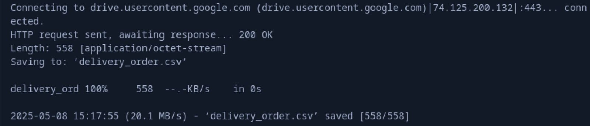

### To download script
```c
file_id="1OJfRuLgsBnIBWtdRXbRsD2sG6NhMKOg9"
file_name="delivery_order.csv"

confirm=$(wget --quiet --save-cookies cookies.txt --keep-session-cookies --no-check-certificate \
"https://docs.google.com/uc?export=download&id=${file_id}" -O- | \
sed -rn 's/.confirm=([0-9A-Za-z_]+)./\1/p')

wget --load-cookies cookies.txt "https://docs.google.com/uc?export=download&confirm=${confirm}&id=${file_id}" \
-O "${file_name}"

rm cookies.txt
```

### Code Block
```c
int mem_fd = shm_open(SHARED_MEM_NAME, O_CREAT | O_RDWR, 0666);
ftruncate(mem_fd, sizeof(SharedOrders));
order_data = mmap(NULL, sizeof(SharedOrders), PROT_READ | PROT_WRITE, MAP_SHARED, mem_fd, 0); 
}
```

### Explanation
> - shm_open(): Creates a shared memory object named /rushgo_memory.
> - ftruncate(): Resizes the shared memory to fit the SharedOrders struct.
> - mmap(): Maps the shared memory into the process’s address space for read/write access.

## Sub Soal b

### Overview
Automatically deliver Express orders using three agent threads (A, B, C). Each agent continuously searches for pending Express orders, delivers them, and logs the activity.

### Input/&Output
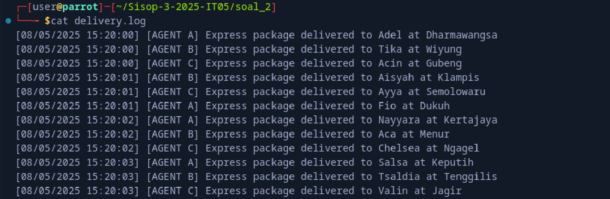

### Code Block
```c
void *AGENTNAME(void *agent_name) {
    char *agent = (char *)agent_name;
    
    while(1) {
        pthread_mutex_lock(&order_data->lock);
        
        int order_found = 0;
        for(int i = 0; i < order_data->total_orders; i++) {
            Order *current = &order_data->orders[i];
            
            if(strcmp(current->service, "Express") == 0 && 
               strcmp(current->status, "Pending") == 0) {
                
                strcpy(current->status, "Delivered");
                strncpy(current->handled_by, agent, 19);
                order_found = 1;
                
                write_log(agent, current->nama, current->alamat, "Express");
                break;
            }
        }
        
        pthread_mutex_unlock(&order_data->lock);
        
        if(order_found) sleep(1);
        else sleep(2);
    }
    return NULL;
}
```

```c
pthread_t agents[3];
char *agent_ids[] = {"AGENT A", "AGENT B", "AGENT C"};

for(int i = 0; i < 3; i++) {
    pthread_create(&agents[i], NULL, AGENTNAME, agent_ids[i]);
}
```

### Explanation
> 1. Infinite Loop: Each agent thread runs continuously.
> 2. Mutex Lock: Safely access shared memory (prevents race conditions).
> 3. Search for Express Orders: Finds the first pending Express order.
> 4. Update Order: Marks the order as delivered and assigns the agent.
> 5. Log Delivery: Writes to delivery.log (fix needed: replace at with in).
> 6. Sleep:
>     Sleeps for 1 second after delivery (simulates work).
>     Sleeps for 2 seconds if no orders found (reduces CPU usage).

## Sub Soal c

### Overview
Allows users to manually deliver Reguler orders via command-line. Each delivery is logged with the user’s OS username as the agent.

### Input/&Output
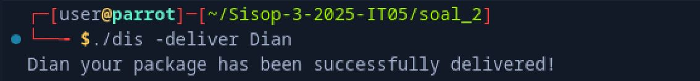

### Code Block (Dispatcher.C)
```c
void deliver_package(char *customer_name) {
    char *user = get_username();  // Get OS username (e.g., "ubuntu_user")
    pthread_mutex_lock(&shared_data->lock);

    for(int i = 0; i < shared_data->total_orders; i++) {
        Order *order = &shared_data->orders[i];
        
        if(strcmp(order->customer, customer_name) == 0 && 
           strcmp(order->service, "Reguler") == 0) {

            // Update status and agent
            strcpy(order->status, "Delivered");
            strcpy(order->handled_by, user);

            // Write to log
            struct tm *tm = localtime(&now);
            fprintf(log, "[%s] [AGENT %s] Reguler package delivered to %s in %s\n",
                    timestamp, user, order->customer, order->address);
            break;
        }
    }
    pthread_mutex_unlock(&shared_data->lock);
}
```

```c
char* get_username() {
    struct passwd *pw = getpwuid(getuid());
    return pw ? pw->pw_name : "unknown";
}
```

### Explanation
> - User Command: Triggers delivery with ./dispatcher -deliver "Tarisa".
> - Shared Memory Access:
>        Locks mutex for thread-safe access.
>        Searches for the first Reguler order matching the customer name.
> - Update Order:
>        Sets status to Delivered.
>        Records the OS username in handled_by.
> - Logging: Appends to delivery.log

## Sub Soal d

### Overview
Allows users to check the delivery status of a specific customer order via command-line. Shows whether the package is `Pending` or `Delivered` (with agent name).

### Input/&Output
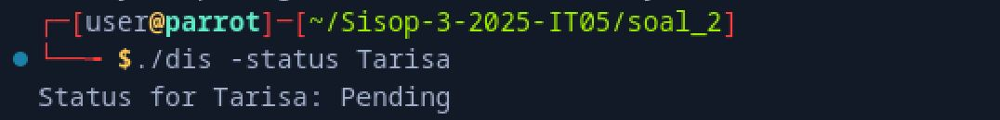

### Code Block (Dispatcher.C)
```c
void check_status(char *customer_name)
{
    pthread_mutex_lock(&shared_data->lock);
    
    for(int i = 0; i < shared_data->total_orders; i++) {
        Order *order = &shared_data->orders[i];
        
        if(strcmp(order->customer, customer_name) == 0) {
            if(strcmp(order->status, "Delivered") == 0) {
                printf("Status for %s: Delivered by Agent %s\n", 
                       customer_name, order->handled_by);
            } else {
                printf("Status for %s: Pending\n", customer_name);
            }
            break; // Stop after first match
        }
    }
    pthread_mutex_unlock(&shared_data->lock);
}
```

### Explanation
> - User Command: ./dispatcher -status "Tarisa"
> - Shared Memory Access: Locks mutex for thread-safe read operations.
> - Order Search: Iterates through orders to find the first match for the customer name.
> - Status Check:
        Returns Delivered by Agent [Name] if delivered.
        Returns Pending if not yet processed.

## Sub Soal e

### Overview
This feature allows the dispatcher to view all delivery orders stored in shared memory.

### Input/&Output
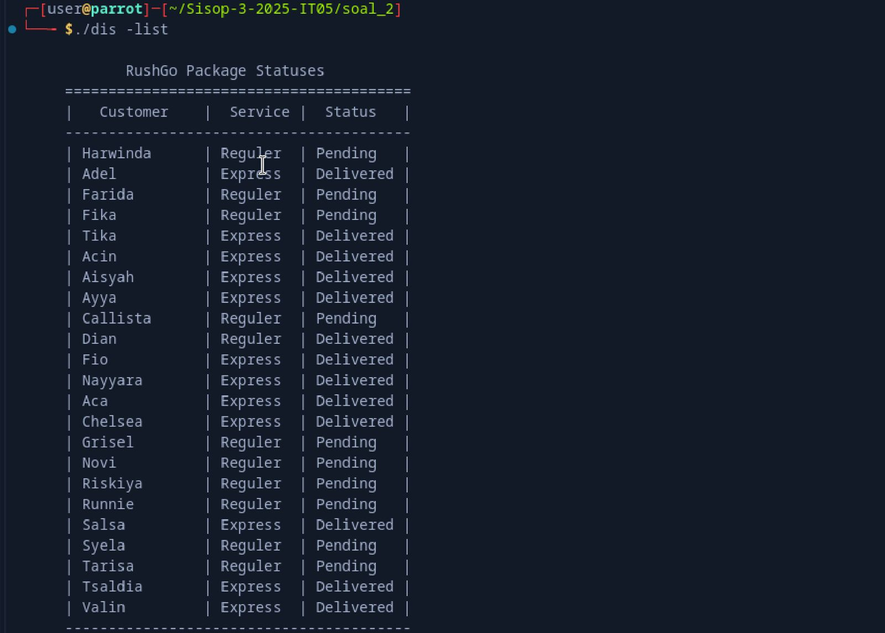

### Code Block (Dispatcher.C)
```c
void list_orders() {
    pthread_mutex_lock(&shared_data->lock);

    printf("\n            RushGo Package Statuses\n");
    printf("     ========================================\n");
    printf("     |   Customer    |  Service |  Status   |\n");
    printf("     ----------------------------------------\n");

    for(int i = 0; i < shared_data->total_orders; i++) {
        Order *order = &shared_data->orders[i];
        printf("     | %-13s | %-8s | %-9s |\n", 
               order->customer, 
               order->service, 
               order->status);
    }

    printf("     ----------------------------------------\n");
    printf("  For more informations, please hit our Contact Person\n\n");

    pthread_mutex_unlock(&shared_data->lock);
}
```

### Explanation
> - list_orders() is a function called when the user runs ./dispatcher -list.
> - It locks the shared memory using pthread_mutex_lock to safely access order data.
> - A loop iterates through each order and prints the customer name, service type, and status in a formatted table.
> - After printing, it releases the lock using pthread_mutex_unlock.

# Soal 3

## Sub Soal a

### Overview
dungeon.c acts as the game server, while player.c acts as the client connected via TCP socket

### Code Block
```c
int main() {
    srand(time(NULL));
    int server_fd, client_fd;
    struct sockaddr_in server_addr, client_addr;
    socklen_t addrlen = sizeof(client_addr);

    server_fd = socket(AF_INET, SOCK_STREAM, 0);
    int opt = 1;
    setsockopt(server_fd, SOL_SOCKET, SO_REUSEADDR, &opt, sizeof(opt));

    server_addr.sin_family = AF_INET;
    server_addr.sin_port = htons(PORT);
    server_addr.sin_addr.s_addr = INADDR_ANY;

    bind(server_fd, (struct sockaddr*)&server_addr, sizeof(server_addr));
    listen(server_fd, MAX_CLIENT);

    printf("Dungeon server listening on port %d...\n", PORT);

    while (1) {
        client_fd = accept(server_fd, (struct sockaddr*)&client_addr, &addrlen);
        if (client_fd < 0) continue;

        printf("Client connected.\n");
        pid_t pid = fork();
        if (pid == 0) {
            close(server_fd);
            handle_client(client_fd);
        } else {
            close(client_fd);
            while (waitpid(-1, NULL, WNOHANG) > 0);
        }
    }

    close(server_fd);
    return 0;
}
```

### Explanation
The main() function is responsible for:
> - Initializing the server socket and setting options.
> - Binding to port 12345.
> - Listening for incoming client connections.
> - Accepting connections using accept().
> - Creating a new process for each client using fork().
> - Calling handle_client() to start the game loop for each player.

## Sub Soal b

### Overview
Sightseeing
When player.c is run, it connects to the dungeon server (dungeon.c) and displays a main menu. Players find interesting things around the dungeon, like a weapon shop and a mysterious door.

### Output
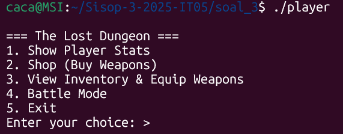

### Code Block
```c
typedef struct {
    int gold;
    int base_damage;
    char weapon_name[50];
    int kills;
    int inventory_count;
    int inventory_index[MAX_INVENTORY];
} Player;
```
### Explanation
Keeps track of the player's current state including money, equipped weapon, performance stats, and weapon inventory. It is used and updated throughout the game to reflect the player's progress.

```c
void send_main_menu(int client_fd) {
    char menu[] =
        "\n=== The Lost Dungeon ===\n"
        "1. Show Player Stats\n"
        "2. Shop (Buy Weapons)\n"
        "3. View Inventory & Equip Weapons\n"
        "4. Battle Mode\n"
        "5. Exit\n";
    send(client_fd, menu, strlen(menu), 0);
}
```
### Explanation
This function sends the main menu options to the client. The menu includes five available actions

```c
void handle_client(int client_fd) {
    char buffer[BUFFER_SIZE];
    int running = 1;

    Player player = {
        .gold = 500,
        .base_damage = 10,
        .weapon_name = "Fists",
        .kills = 0,
        .inventory_count = 1,
        .inventory_index = {0}
    };
```

### Explanation
This function manages the entire game logic for one connected client.
> - At the start, it initializes a Player structure with default values

## Sub Soal c

### Overview
Status Check
Choosing Show Player Stats displays the player's current gold, equipped weapon, base damage, and total kills. Useful before buying weapons.

### Output
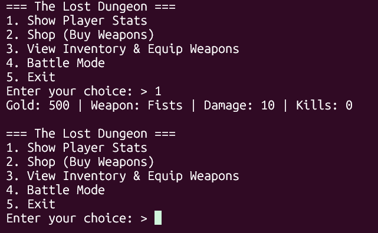

### Code Block
```c
case 1: {
                Weapon *equipped = get_equipped_weapon(&player);
                if (equipped && equipped->has_passive) {
                    snprintf(buffer, BUFFER_SIZE,
                        "Gold: %d | Weapon: %s | Damage: %d | Kills: %d\nPassive: %s\n",
                        player.gold, player.weapon_name, player.base_damage, player.kills,
                        equipped->passive);
                } else {
                    snprintf(buffer, BUFFER_SIZE,
                        "Gold: %d | Weapon: %s | Damage: %d | Kills: %d\n",
                        player.gold, player.weapon_name, player.base_damage, player.kills);
                }
                send(client_fd, buffer, strlen(buffer), 0);
                break;
            }
```

### Explanation
> - Displays current gold, weapon name, base damage, and kill count.
> - Also shows passive ability if the equipped weapon has one.
> - Helps the player evaluate their readiness for battle or shopping.

## Sub Soal d

### Overview
Weapon Shop
Upon entering the shop, players can view a list of at least 5 weapons, each with price, damage, and optional passive effects. Two or more weapons must have unique passives.


### Output
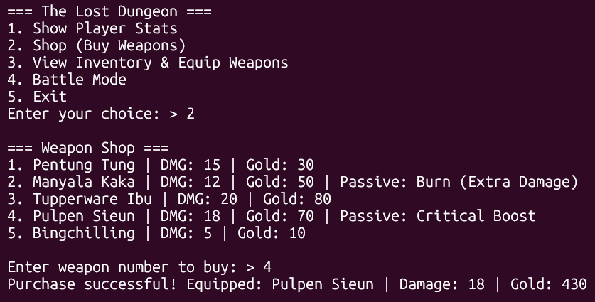

### Code Block in shop.c
```c
typedef struct {
    char name[50];
    int damage;
    int price;
    char passive[100];
    int has_passive;
} Weapon;
```
### Explanation
This struct represents a weapon with its attributes: name, damage, price, and an optional passive ability.

```c
#define MAX_WEAPONS 6

Weapon weapon_list[MAX_WEAPONS] = {
    {"Fists", 10, 0, "", 0},
    {"Pentung Tung", 15, 30, "", 0},
    {"Manyala Kaka", 12, 50, "Burn (Extra Damage)", 1},
    {"Tupperware Ibu", 20, 80, "", 0},
    {"Pulpen Sieun", 18, 70, "Critical Boost", 1},
    {"Bingchilling", 5, 10, "", 0}
};
```
### Explanation
> - A predefined array of 6 weapons available in the shop.
> - Index 0 ("Fists") is the default weapon and cannot be bought.
> - At least 2 weapons have unique passive effects (Burn and Critical Boost).


```c
void list_weapons(char *out) {
    strcpy(out, "\n=== Weapon Shop ===\n");
    for (int i = 1; i < MAX_WEAPONS; ++i) { // Lewati indeks 0 (Fists)
        char line[256];
        snprintf(line, sizeof(line), "%d. %s | DMG: %d | Gold: %d%s%s\n",
                 i,
                 weapon_list[i].name,
                 weapon_list[i].damage,
                 weapon_list[i].price,
                 weapon_list[i].has_passive ? " | Passive: " : "",
                 weapon_list[i].has_passive ? weapon_list[i].passive : "");
        strcat(out, line);
    }
}
```
### Explanation
> - This function builds a string listing all buyable weapons (excluding Fists) and stores it in out.
> - Each weapon's name, damage, price, and passive (if any) is displayed.

```c
int buy_weapon(int index, int *gold, char *equipped_weapon, int *base_damage) {
    if (index <= 0 || index >= MAX_WEAPONS)
        return -2; // indeks tidak valid atau mencoba beli "Fists"

    Weapon w = weapon_list[index];
    if (*gold < w.price)
        return -1; 

    *gold -= w.price;
    strcpy(equipped_weapon, w.name);
    *base_damage = w.damage;

    return 0; 
}

```
### Explanation
This function processes the weapon purchase:
> - Returns -2 if the index is invalid or refers to "Fists".
> - Returns -1 if the player has insufficient gold.
> - On success (0), deducts gold, equips the weapon, and updates the player's damage.

## Code block's in dungeon.c
```c
Case 2: {
                char shop_menu[2048];
                list_weapons(shop_menu);
                send(client_fd, shop_menu, strlen(shop_menu), 0);

                send(client_fd, "\nEnter weapon number to buy: ", 31, 0);
                memset(buffer, 0, BUFFER_SIZE);
                recv(client_fd, buffer, BUFFER_SIZE, 0);
                int chosen_index = atoi(buffer);

                int res = buy_weapon(chosen_index, &player.gold, player.weapon_name, &player.base_damage);
                if (res == 0) {
                    if (player.inventory_count < MAX_INVENTORY)
                        player.inventory_index[player.inventory_count++] = chosen_index;
                    snprintf(buffer, BUFFER_SIZE,
                        "Purchase successful! Equipped: %s | Damage: %d | Gold: %d\n",
                        player.weapon_name, player.base_damage, player.gold);
                } else if (res == -1) {
                    snprintf(buffer, BUFFER_SIZE, "Not enough gold!\n");
                } else {
                    snprintf(buffer, BUFFER_SIZE, "Invalid weapon!\n");
                }
                send(client_fd, buffer, strlen(buffer), 0);
                break;
                }
```

### Explanation
> - Shows all available weapons to purchase.
> - Prompts player to enter weapon number.
> - Buys and equips the weapon if valid and enough gold.
> - Adds weapon to inventory if there's space.
> - Sends error message for invalid input or insufficient gold.


## Sub Soal e

### Overview
Handy Inventory
Players can view and equip weapons from their inventory. If a weapon has a passive, it is shown. Equipping a new weapon updates the player's damage and passive status.

### Output
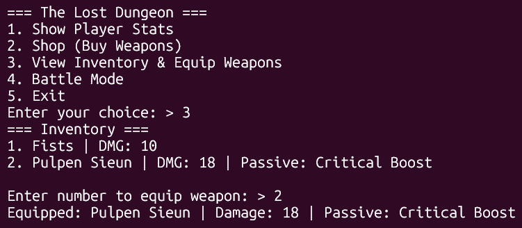

### Code Block
```c
case 3: {
                char inv[2048] = "=== Inventory ===\n";
                for (int i = 0; i < player.inventory_count; i++) {
                    int idx = player.inventory_index[i];
                    Weapon w = weapon_list[idx];
                    char line[256];
                    snprintf(line, sizeof(line), "%d. %s | DMG: %d%s%s\n",
                        i + 1, w.name, w.damage,
                        w.has_passive ? " | Passive: " : "",
                        w.has_passive ? w.passive : "");
                    strcat(inv, line);
                }
                send(client_fd, inv, strlen(inv), 0);

                send(client_fd, "\nEnter number to equip weapon: ", 34, 0);
                memset(buffer, 0, BUFFER_SIZE);
                recv(client_fd, buffer, BUFFER_SIZE, 0);
                int chosen = atoi(buffer) - 1;
                if (chosen >= 0 && chosen < player.inventory_count) {
                    int idx = player.inventory_index[chosen];
                    Weapon w = weapon_list[idx];
                    strcpy(player.weapon_name, w.name);
                    player.base_damage = w.damage;
                    snprintf(buffer, BUFFER_SIZE,
                        "Equipped: %s | Damage: %d%s%s\n",
                        w.name, w.damage,
                        w.has_passive ? " | Passive: " : "",
                        w.has_passive ? w.passive : "");
                } else {
                    snprintf(buffer, BUFFER_SIZE, "Invalid choice!\n");
                }
                send(client_fd, buffer, strlen(buffer), 0);
                break;
            }
```

### Explanation
> - Shows all weapons the player owns.
> - Displays passive effects if available.
> - Prompts player to choose a weapon to equip.
> - Updates player's weapon_name and base_damage.
> - Sends error message if input is invalid.

## Sub Soal f

### Overview
Enemy Encounter
Entering Battle Mode spawns a random enemy (50–200 HP). Players can attack or exit. Enemy HP and health bar are updated each turn. Defeating an enemy grants gold and spawns a new one.


### Output
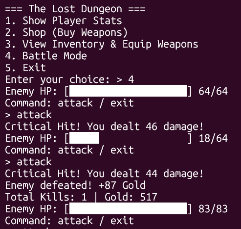

### Code Block

```c
typedef struct {
    int max_hp;
    int hp;
} Enemy;
```
```c
Enemy generate_enemy() {
    Enemy e;
    e.max_hp = (rand() % 151) + 50;
    e.hp = e.max_hp;
    return e;
}
```
### Explanation
This function creates and returns a new enemy with random health points.


```c
void render_health_bar(char *dest, int hp, int max_hp) {
    int bar_width = 20;
    int filled = (hp * bar_width) / max_hp;
    strcpy(dest, "[");
    for (int i = 0; i < bar_width; i++) {
        strcat(dest, (i < filled) ? "█" : " ");
    }
    strcat(dest, "]");
}
```
### Explanation
This function generates a visual health bar string (e.g., [█████ ]) based on the enemy’s current hp and max_hp.

```c
case 4: {
                Enemy enemy = generate_enemy();
                Weapon *equipped = get_equipped_weapon(&player);
                while (enemy.hp > 0) {
                    char bar[64];
                    render_health_bar(bar, enemy.hp, enemy.max_hp);
                    snprintf(buffer, BUFFER_SIZE,
                        "Enemy HP: %s %d/%d\nCommand: attack / exit\n",
                        bar, enemy.hp, enemy.max_hp);
                    send(client_fd, buffer, strlen(buffer), 0);

                    memset(buffer, 0, BUFFER_SIZE);
                    recv(client_fd, buffer, BUFFER_SIZE, 0);
                    buffer[strcspn(buffer, "\n")] = 0;

                    if (strcmp(buffer, "exit") == 0) {
                        snprintf(buffer, BUFFER_SIZE, "You fled the battle!\n");
                        send(client_fd, buffer, strlen(buffer), 0);
                        break;
                    } else if (strcmp(buffer, "attack") != 0) {
                        snprintf(buffer, BUFFER_SIZE, "Unknown command! Type 'attack' or 'exit'.\n");
                        send(client_fd, buffer, strlen(buffer), 0);
                        continue;
                    }
```

### Explanation
> - This block implements the real-time combat logic, where:
> - The player is repeatedly prompted to either attack or flee.
> - The enemy’s health is updated every turn.
> - The player’s command is validated and handled accordingly.

## Sub Soal g
Other Battle Logic

### Overview
- Health & Rewards
- Damage Equation

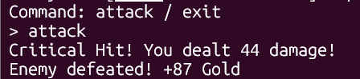

- Passive

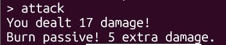

## Sub Soal h

### Overview
Error Handling
Invalid inputs (like unknown menu options) are properly handled and trigger warning messages.


### Output
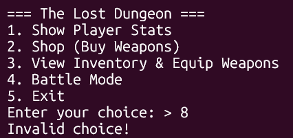

### Code Block
```c
default:
                snprintf(buffer, BUFFER_SIZE, "Invalid choice!\n");
                send(client_fd, buffer, strlen(buffer), 0);
                break;
```

### Explanation
it ensures that the player is notified when entering an unrecognized menu option.


### Player.c

### Code Block
```c
int sockfd;
struct sockaddr_in server_addr;
char buffer[BUFFER_SIZE];

sockfd = socket(AF_INET, SOCK_STREAM, 0);
if (sockfd < 0) {
    perror("Socket creation failed");
    exit(EXIT_FAILURE);
}

server_addr.sin_family = AF_INET;
server_addr.sin_port = htons(PORT);
inet_pton(AF_INET, IP, &server_addr.sin_addr);

if (connect(sockfd, (struct sockaddr*)&server_addr, sizeof(server_addr)) < 0) {
    perror("Connection failed");
    close(sockfd);
    exit(EXIT_FAILURE);
}
```

### Explanation
> - This creates a TCP socket ```(SOCK_STREAM)```. If socket creation fails, the program prints an error and exits.
> - Sets the address and port of the server to connect to (127.0.0.1:PORT) using IPv4 (AF_INET).
> - Attempts to connect to the server. If the connection fails, it closes the socket and exits.

### Code Block
```c
while (1) {
    memset(buffer, 0, BUFFER_SIZE);
    int bytes = recv(sockfd, buffer, BUFFER_SIZE - 1, 0);
    if (bytes <= 0) break;
    buffer[bytes] = '\0';
    printf("%s", buffer);
```

### Explanation
Receives and displays the main menu sent by the server. If the server disconnects or there's an error, it breaks the loop.

### Code Block
```c
    printf("> ");
    fgets(buffer, BUFFER_SIZE, stdin);
    buffer[strcspn(buffer, "\n")] = 0;
    send(sockfd, buffer, strlen(buffer), 0);

    if (strcmp(buffer, "5") == 0) break;

    while (1) {
        memset(buffer, 0, BUFFER_SIZE);
        bytes = recv(sockfd, buffer, BUFFER_SIZE - 1, 0);
        if (bytes <= 0) break;
        buffer[bytes] = '\0';
        printf("%s", buffer);

        if (strstr(buffer, "Enter") || strstr(buffer, "Command:")) {
            printf("> ");
            fgets(buffer, BUFFER_SIZE, stdin);
            buffer[strcspn(buffer, "\n")] = 0;
            send(sockfd, buffer, strlen(buffer), 0);
        } else {
            break;
        }
    }
}

close(sockfd);
return 0;

```

### Explanation
> - Reads the player's choice (menu option), removes the newline, and sends it to the server. If the input is "5", it exits the game.
> - Receives additional responses from the server (e.g., shop info, battle updates, etc.).
> - If the server’s message includes "Enter" or "Command:", the client assumes the server is waiting for additional input (e.g., choosing a weapon, typing "attack"). If not, it breaks and goes back to the main menu loop.
> - Once the player exits the game (option 5), the client socket is closed and the program ends cleanly.

# Soal 4

## Sub Soal a

### Overview
Shared memory is used to synchronize data between two programs: system.c for game management and hunter.c for player interaction.

### Input/&Output


### Code Block
```c
key_t key = ftok("system.c", 'S');
shmid = shmget(key, sizeof(GameData), IPC_CREAT | 0666);
game = shmat(shmid, NULL, 0);

sem_id = semget(key, 1, IPC_CREAT | 0666);
semctl(sem_id, 0, SETVAL, 1);
```

### Explanation
> - ftok(): Generate IPC key from file.
> - shmget(): Create shared memory.
> - shmat(): Attach shared memory.
> - semget(), semctl(): Create and initialize semaphore.

## Sub Soal b

### Overview
Register a new hunter with a unique key and default stats.

### Input/&Output


### Code Block
```c
Hunter h;
printf("Enter hunter name: ");
scanf("%s", h.name);

h.key = rand() % 9000 + 1000;
h.banned = 0;
h.stats = (Stats){1, 10, 100, 5, 0};

game->hunters[game->total_hunters] = h;
game->total_hunters++;

printf("Hunter registered! Key: %d\n", h.key);
```

### Explanation
> It generates random key and initializes hunter data.

## Sub Soal c

### Overview
List all registered hunters.

### Input/&Output


### Code Block
```c
printf("=== HUNTERS LIST ===\n");
for (int i = 0; i < game->total_hunters; i++) {
    Hunter h = game->hunters[i];
    printf("%s (Key:%d) Lv.%d %s\n", h.name, h.key, h.stats.level, h.banned ? "[BANNED]" : "");
}
```

### Explanation
> Loop to print hunter details.

## Sub Soal d

### Overview
Ban a hunter using their key.

### Input/&Output


### Code Block
```c
int key;
printf("Enter hunter key to ban: ");
scanf("%d", &key);

for (int i = 0; i < game->total_hunters; i++) {
    if (game->hunters[i].key == key) {
        game->hunters[i].banned = 1;
        printf("Hunter banned!\n");
        return;
    }
}
printf("Hunter not found!\n");
```

### Explanation
> Search and ban matching hunter by key.

## Sub Soal e

### Overview
Create a dungeon with random attributes.

### Input/&Output


### Code Block
```c
Dungeon d;
sprintf(d.name, "Dungeon%d", game->total_dungeons + 1);
d.min_level = rand() % 5 + 1;
d.rewards = (Stats){
    .atk = rand() % 51 + 100,
    .hp = rand() % 51 + 50,
    .def = rand() % 26 + 25,
    .exp = rand() % 151 + 150
};

game->dungeons[game->total_dungeons] = d;
game->total_dungeons++;
```

### Explanation
> Random dungeon attributes are set and saved.

## Sub Soal f

### Overview
Login using hunter key.

### Input/&Output


### Code Block
```c
printf("Enter key: ");
scanf("%d", &current_key);

Hunter *h = findHunter(current_key);
if (!h || h->banned) {
    printf("Invalid or banned key.\n");
    exit(1);
}
me = h;
```

### Explanation
> Validates login and sets me pointer.

## Sub Soal g

### Overview
List available dungeons and current hunter stats.

### Input/&Output


### Code Block
```c
printf("Level: %d\n", me->stats.level);
printf("EXP: %d/500\n", me->stats.exp);
printf("ATK: %d\n", me->stats.atk);
printf("HP: %d\n", me->stats.hp);
printf("DEF: %d\n", me->stats.def);

for (int i = 0; i < game->total_dungeons; i++) {
    Dungeon d = game->dungeons[i];
    printf("[%d] %s (Lv.%d+)\n", i, d.name, d.min_level);
    printf("   Reward: ATK+%d HP+%d DEF+%d EXP+%d\n",
           d.rewards.atk, d.rewards.hp, d.rewards.def, d.rewards.exp);
}
```

### Explanation
> Display hunter stats and dungeons.

## Sub Soal h

### Overview
Enter a dungeon and get rewards.

### Input/&Output


### Code Block
```c
int num;
scanf("%d", &num);
Dungeon d = game->dungeons[num];

if (me->stats.level < d.min_level) {
    printf("Level too low!\n");
    return;
}

me->stats.atk += d.rewards.atk;
me->stats.hp += d.rewards.hp;
me->stats.def += d.rewards.def;
me->stats.exp += d.rewards.exp;

if (me->stats.exp >= 500) {
    me->stats.level++;
    me->stats.exp = 0;
    printf("Level up! Now Lv.%d\n", me->stats.level);
}
```

### Explanation
> Dungeon rewards added, level up if EXP reaches threshold.

## Sub Soal i

### Overview
Auto-refresh available dungeons every 3 seconds.

### Input/&Output


### Code Block
```c
while (1) {
    system("clear");
    for (int i = 0; i < game->total_dungeons; i++) {
        Dungeon d = game->dungeons[i];
        if (me->stats.level >= d.min_level) {
            printf("[%d] %s (Lv.%d+)\n", i, d.name, d.min_level);
            printf("   Reward: ATK+%d HP+%d DEF+%d EXP+%d\n\n",
                   d.rewards.atk, d.rewards.hp, d.rewards.def, d.rewards.exp);
        }
    }
    sleep(3);
}
```

### Explanation
> Continuous loop that filters dungeons by hunter level.

## Sub Soal j

### Overview
Clean up shared memory and semaphore.

### Input/&Output


### Code Block
```c
shmdt(game);
shmctl(shmid, IPC_RMID, NULL);
semctl(sem_id, 0, IPC_RMID);
```

### Explanation
> Detaches and removes IPC resources.

## Sub Soal k

### Overview
Lock and unlock wrappers using semaphore.

### Input/&Output


### Code Block
```c
void lock() {
    struct sembuf op = {0, -1, 0};
    semop(sem_id, &op, 1);
}

void unlock() {
    struct sembuf op = {0, 1, 0};
    semop(sem_id, &op, 1);
}
```

### Explanation
> Basic semaphore operation to control access.

## Sub Soal l

### Overview
Define core data structures.

### Input/&Output


### Code Block
```c
#define MAX_HUNTERS 10
#define MAX_DUNGEONS 10

typedef struct {
    int level, atk, hp, def, exp;
} Stats;

typedef struct {
    char name[20];
    int key;
    int banned;
    Stats stats;
} Hunter;

typedef struct {
    char name[20];
    int min_level;
    Stats rewards;
} Dungeon;

typedef struct {
    Hunter hunters[MAX_HUNTERS];
    int total_hunters;
    Dungeon dungeons[MAX_DUNGEONS];
    int total_dungeons;
} GameData;

GameData *game;
Hunter *me;
int shmid, sem_id;
```

### Explanation
> Structs for shared game state and global variables.
